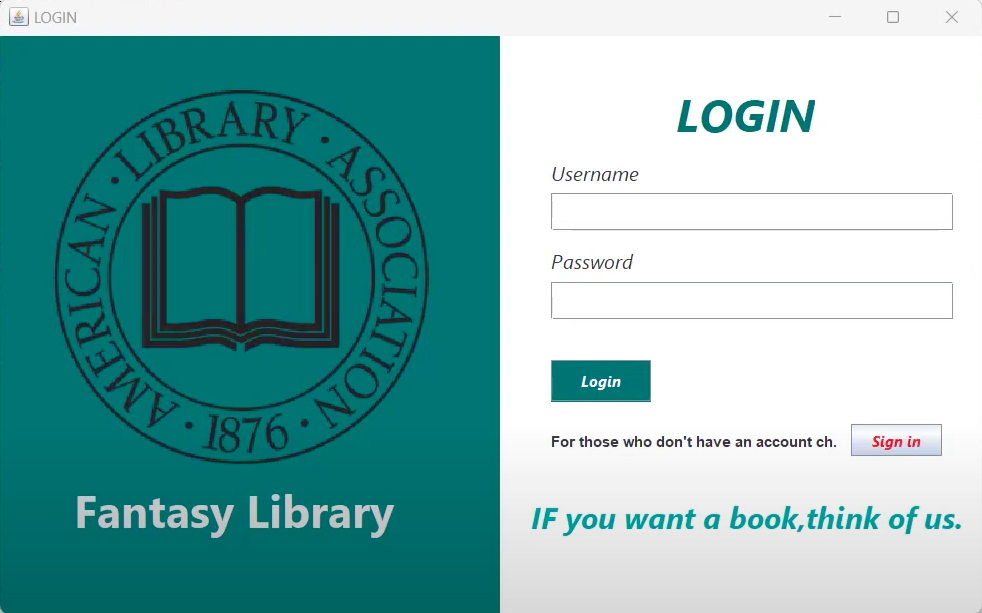

# Project Computer Library
## คำอธิบายโปรเจ็ค : โปรเจ็คห้องสมุดนี้ใช้ภาษา Java ในการเขียนโดยมีฐานข้อมูลที่ใช้จะเป็น phpMyAdmin เพื่อเก็บข้อมูลต่างๆ (มีแต่ demo ครับ)
## สามารถเข้าไปรับชมวิดีโอรายละเอียดโปรเจ็คได้ผ่านลิ้งนี้ [Youtube](https://www.youtube.com/watch?v=Nx55upIq5hY&t=15s)
## หรือสามารถอ่านรายละเอียดโปรเจ็คได้ตามคำอธิบายได้ผ่านด้านล่าง
### โปรเจ็คนี้มี Function ดังนี้
1.หน้าต่าง Login
[]
คำอธิบาย : ระบบของห้องสมุดจะมีการ Login อยู่ 2 แบบคือ 1)แบบ User และ 2)แบบ Admin โดยจะให้ผู้ใช้งานกรอกข้อมูล Username และ Password จากนั้นข้อมูลจะถูกส่งนำไปตรวจสอบกับฐานข้อมูลว่าข้อมูลถูกต้องหรือไม่ 
ถ้าข้อมูลไม่ถูกต้องจะมีการแจ้งเตือนว่าข้อมูลไม่ถูก
ถ้าข้อมูลถูกต้อง ระบบจะตรวจสอบด้วยว่าเป็น User หรือ Admin แล้วจึงจะมีหน้าต่างให้เข้าใช้งานต่อไป

