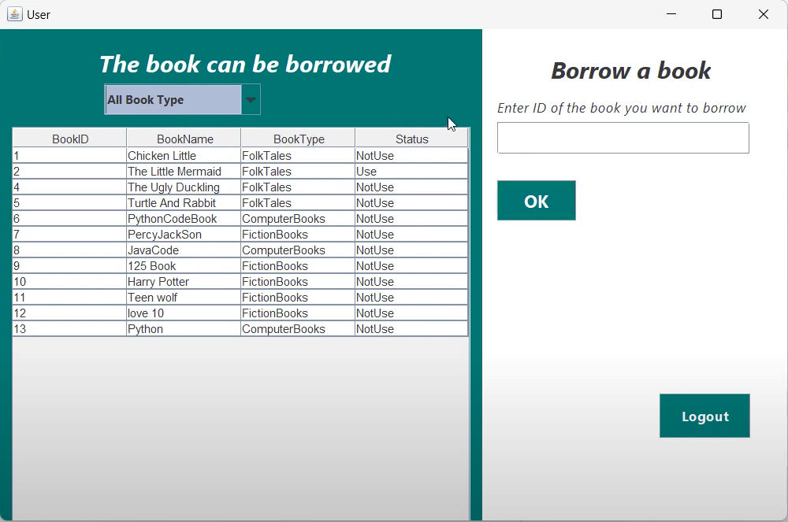
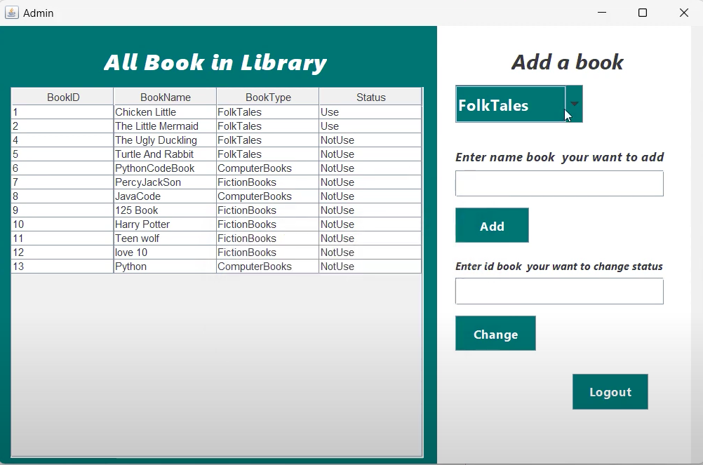

# Project Computer Library
### คำอธิบายโปรเจ็ค : โปรเจ็คห้องสมุดนี้ใช้ภาษา Java ในการเขียนโดยมีฐานข้อมูลที่ใช้จะเป็น phpMyAdmin เพื่อเก็บข้อมูลต่างๆ (มีแต่ demo ครับ)
### สามารถเข้าไปรับชมวิดีโอรายละเอียดโปรเจ็คได้ผ่านลิ้งนี้ [Youtube](https://www.youtube.com/watch?v=Nx55upIq5hY&t=15s)
### หรือสามารถอ่านรายละเอียดโปรเจ็คได้ตามคำอธิบายได้ผ่านด้านล่าง
## โปรเจ็คนี้มี Function ดังนี้
1.หน้าต่าง Login หรือ การเข้าสู่ระบบ

คำอธิบาย : ระบบของห้องสมุดจะมีการ Login อยู่ 2 แบบคือ 1)แบบ User และ 2)แบบ Admin โดยจะให้ผู้ใช้งานกรอกข้อมูล Username และ Password จากนั้นข้อมูลจะถูกส่งนำไปตรวจสอบกับฐานข้อมูลว่าข้อมูลถูกต้องหรือไม่

* ถ้าข้อมูลไม่ถูกต้องจะมีการแจ้งเตือนว่าข้อมูลไม่ถูก
* ถ้าข้อมูลถูกต้อง ระบบจะตรวจสอบด้วยว่าเป็น User หรือ Admin แล้วจึงจะมีหน้าต่างให้เข้าใช้งานต่อไป
* แต่ถ้าไม่มีรหัสสามารถเข้าไปสมัคร ผ่านการกดปุ่ม Sign in ด้านล่าง แล้วจะมีหน้าต่าง Sign Up ขึ้นมา

2.หน้าต่าง SignUp หรือ การสมัครสมาชิก

คำอธิบาย : การสมัครสมาชิกนั้นเป็นการสมัครสมาชิกสำหรับ User ซึ่งผู้ใช้งานต้องกรอกข้อมูล (ไม่มีการสมัครแบบ Admin)

1. Fullname : ชื่อจริงของผู้ใช้งาน
2. Username : ชื่อรหัสผ่านของผู้ใช้งาน
3. Password : รหัสผ่านการเข้าใช้งาน

และจากนั้นกดปุ่ม Sign Up ข้อมูลที่กรอกเข้ามาจะถูกส่งไปยังฐานข้อมูลและสามารถเข้าสู่ระบบเข้าใช้งานได้

3.หน้าต่าง User

คำอธิบาย : หน้าต่างนี้จะมีเรียกข้อมูลจากฐานข้อมูลมา Map เป็น Table เพื่อแสดงผลและผู้ใช้งานสามารถยืมหนังสือจากการกรอกตัวเลข Book ID และต้องมี Status ที่เป็น NotUse 
* แต่ถ้าเป็น Use แสดงว่าไม่สามารถยืมได้ แล้วจะมีการแจ้งเตือนขึ้นมา

ผู้ใช้งานสามารถใช้ Filter ที่เป็นปุ่ม Dropdown เพื่อหาชนิดหนังสือที่ต้องการได้ทันที

4.หน้าต่าง Admin 

คำอธิบาย : หน้าต่างนี้จะมีอยู่ 2 ระบบ
1. ระบบเพิ่มหนังสือ
    * Admin ต้องเลือกชนิดของหนังสือและชื่อหนังสือที่จะเพิ่มเข้าระบบจากนั้นข้อมูลที่กรอกจะส่งไปยังฐานข้อมูล

2. ระบบการรับคืนหนังสือ
    * Admin จะกรอกตัวเลข BookID ของหนังสือที่ได้รับคืนจาก User และ Status ของหนังสือจาก Use จะเป็น NotUse ข้อมูลที่เปลี่ยน Status จะส่งไปยังฐานข้อมูลเช่นกัน

#### ขอบคุณที่รับชมรายละเอียดของ Project ครับ

